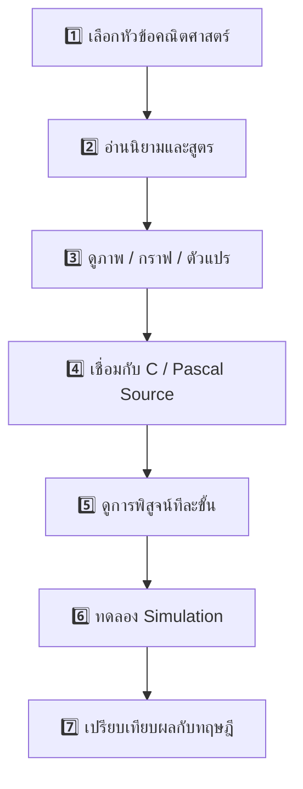

# V4.7 Visual Learning Guide — สำหรับนักเรียนพิการหู

## เส้นทางการเรียน

## สัญลักษณ์ที่ใช้

| สัญลักษณ์ | ความหมาย | นักเรียนทำอะไร |
|---|---|---|
| 👁 | ดู | อ่านหัวข้อและข้อมูลบนหน้าจอ |
| ∑ | คณิตศาสตร์ | อ่านสูตร นิยาม และตัวแปร |
| </> | Source Code | ดูหลักฐานจาก C/Pascal |
| ✓ | Proof | ติดตามเหตุผลทีละขั้น |
| ▶ | Simulation | ทดลองและดูกราฟ |

## กติกาการเรียน

**อย่าข้ามจาก Source ไป Simulation ทันที**

ลำดับที่ต้องการคือ:

**Concept → Formula → Source Evidence → Proof/Derivation → Simulation**

Simulation ช่วยให้เห็นผล แต่ไม่แทนการพิสูจน์ทางคณิตศาสตร์
