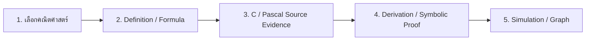
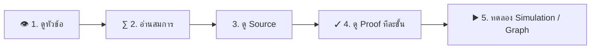

# AI Learning Studio V4.7 — คู่มือการใช้งานและการติดตั้ง

เอกสารนี้สรุปหลักการทำงาน การติดตั้งบน Windows และแนวทางสื่อสารแบบภาพสำหรับนักเรียนพิการหูของ AI Learning Studio V4.7 FIXED

## 1. หลักการทำงาน

แนวคิดหลักคือ **Mathematics First**: เริ่มจากแนวคิดทางคณิตศาสตร์ก่อน แล้วจึงเชื่อมไปยังหลักฐานจาก Source Code ภาษา C/Pascal การพิสูจน์ และการจำลอง

V4.7 ใช้ Mathematical Knowledge Map เชื่อม Algebra, Geometry, Trigonometry, Probability, Statistics และ Sequence/Recurrence โดยจัดลำดับ Concept → Prerequisite → Formula → Source Evidence → Proof/Derivation → Simulation

### ตัวอย่าง Recurrence

`x_(n+1) = a x_n + b`

โปรแกรมไม่ควรเรียก assignment ว่าเป็น recurrence เพียงเพราะตัวแปรปรากฏทั้งด้านซ้ายและด้านขวา แต่ต้องตรวจบริบทของการ update ซ้ำก่อน เมื่อยืนยัน affine recurrence ได้ สำหรับ `a != 1` ใช้

`L = b/(1-a)`

`x_n = L + a^n (x_0-L)`

จากนั้นจึงพิสูจน์เชิงสัญลักษณ์/อุปนัย วิเคราะห์ convergence และทำ simulation ภายหลัง **Simulation เป็นการตรวจเชิงตัวเลข ไม่ใช่สิ่งทดแทน proof**

## 2. คู่มือการติดตั้งบน Windows

แนะนำ Windows 10/11 และ Python 3.10 ตัวติดตั้ง V4.7 FIXED จะพยายามเลือก Python 3.10 ก่อน และตรวจ Tkinter ก่อนสร้าง environment

1. แตกไฟล์ ZIP ออกทั้งหมดก่อน ห้ามรันไฟล์ BAT จากภายใน ZIP
2. เข้าโฟลเดอร์โปรแกรม
3. ดับเบิลคลิก `INSTALL_AND_RUN.bat`
4. ระบบตรวจ Python และ Tkinter สร้าง `.venv` และติดตั้ง package เสริม
5. เมื่อเสร็จ โปรแกรมจะเปิด AI Learning Studio

### ถ้าโปรแกรมไม่เปิด

ดับเบิลคลิก `DIAGNOSE_AND_RUN.bat` และเปิดหน้าต่าง Command Prompt ค้างไว้ เพื่อดู error/traceback จริง

- ไม่พบ Python: ติดตั้ง Python 3.10/3.11 และเปิดตัวเลือก Add Python to PATH
- Tkinter missing: ติดตั้ง Python ใหม่พร้อม Tcl/Tk
- package เสริมติดตั้งไม่สำเร็จ: Core GUI ยังออกแบบให้เปิดได้ในหลายกรณี ให้ดูรายละเอียดจาก diagnostic console
- ดับเบิลคลิกแล้วเงียบ: ใช้ `DIAGNOSE_AND_RUN.bat`

## 3. คู่มือภาพสำหรับนักเรียนพิการหู

ข้อมูลสำคัญควรอยู่ในรูปแบบที่มองเห็นได้ และไม่ใช้เสียงเป็นช่องทางข้อมูลเพียงช่องทางเดียว

### วิธีเรียนทีละขั้น

1. **ดู** — เลือกหัวข้อคณิตศาสตร์จาก Knowledge Map
2. **เข้าใจ** — อ่าน Definition, Formula และ Prerequisite
3. **เชื่อม** — ดูบรรทัด C/Pascal ที่โปรแกรมนำมาเป็น Source Evidence
4. **พิสูจน์** — ติดตาม Derivation/Proof ทีละขั้นก่อน Simulation
5. **ทดลอง** — ใช้ Simulation/Graph แล้วเปรียบเทียบผลกับสูตรหรือ Closed Form

### แนวทางสำหรับครู

- คำสั่งสำคัญควรมีข้อความบนหน้าจอ ไม่ใช้เสียงเตือนเป็นข้อมูลเพียงช่องทางเดียว
- ใช้หมายเลข 1 → 2 → 3 เพื่อแสดงลำดับ
- ใช้สูตร กราฟ และข้อความสั้นร่วมกัน
- วิดีโอการสอนควรมี caption หรือข้อความสรุป
- ชี้ความสัมพันธ์ Source → Formula → Proof → Simulation อย่างชัดเจน

> จำง่าย: **คณิตศาสตร์ → Source → Proof → Simulation**

## หมายเหตุ V4.7 FIXED

V4.7 FIXED ผ่านการตรวจ syntax, ตรวจเมนู 51 รายการ และ GUI startup smoke test ในสภาพแวดล้อมทดสอบแล้ว อย่างไรก็ตาม Windows แต่ละเครื่องอาจมี Python environment ต่างกัน จึงควรใช้ `DIAGNOSE_AND_RUN.bat` เมื่อพบปัญหา
